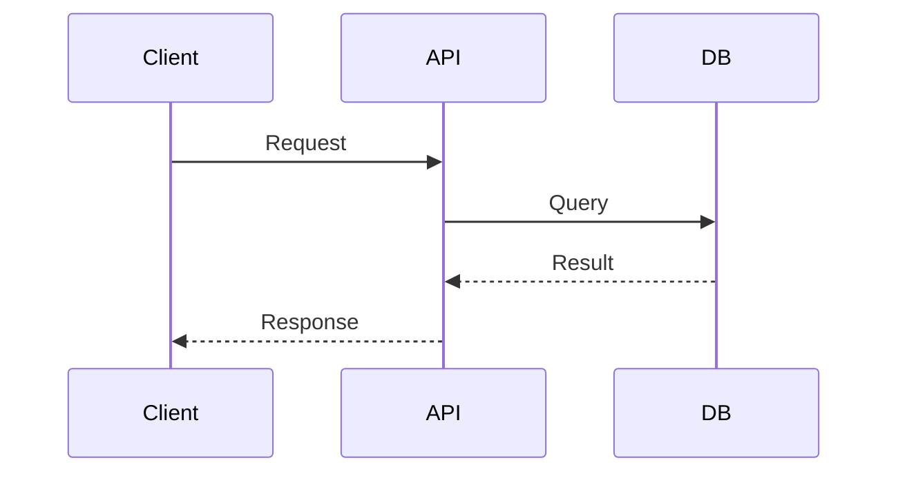
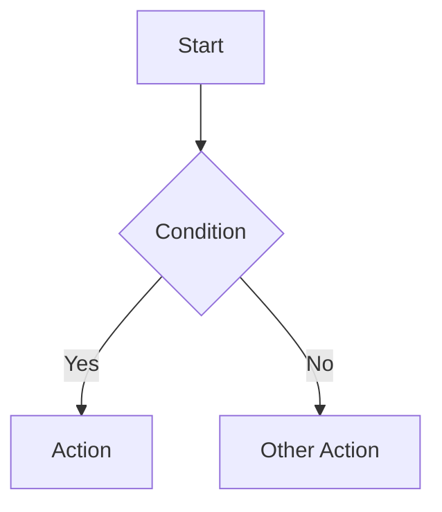
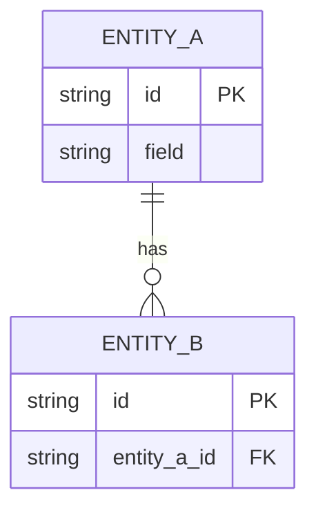

# Spec Action

Take a raw requirement from the user and generate a complete spec document.

The spec must be readable by **both humans and AI** — structured enough for autopilot to parse, visual enough for a developer to review.

## Steps

### Step 1: Receive Requirement

Read $ARGUMENTS as the raw requirement. If empty, ask ONE question: "What do you want to build or fix?"

### Step 2: Analyze First, Ask Only When Needed

Read all information provided in $ARGUMENTS carefully. Infer as much as possible from context.

- Read @docs/project-overview.md and @docs/coding-standards.md for project context.
- Inspect relevant existing code to understand current patterns.
- Auto-fill every section you can confidently derive from what was given.
- For sections that are **ambiguous or missing**, ask **one question at a time** — wait for the answer before asking the next.
- If everything is clear, skip asking entirely and proceed to writing the spec.

Sections to derive or ask about:
- **Type**: Infer from context (`feature` / `fix`). Ask only if truly unclear.
- **Overview**: Derive from description. Confirm only if ambiguous.
- **Goals**: Break requirement into concrete, verifiable outcomes.
- **Input**: Identify from description. Ask if inputs are not mentioned.
- **Output**: Derive expected results as Given/When/Then test cases. Ask if success criteria are unclear.
- **Flow**: Reconstruct from description. Ask only if sequence/logic is not inferable.
- **Usecases**: Derive from context. Ask if actors or scenarios are not mentioned.

### Step 3: Write Spec

Save to `docs/specs/{kebab-case-name}.md` using this format:

```markdown
# {Feature/Fix Name}

**Type:** feature | fix

## Overview

{A concise summary of what this feature/fix is, what problem it solves, and why it matters.}

## Requirement

{Original requirement from user — preserved verbatim}

## Goals

- {goal 1 — concrete, verifiable}
- {goal 2}

## Input

{Describe all inputs: user actions, API request payloads, form fields, events, etc.}

| Input | Type | Required | Description |
|-------|------|----------|-------------|
| {name} | {type} | {yes/no} | {description} |

## Output

{Describe expected outputs as test cases — what must be true when it works correctly.}

- **Given** {condition}, **when** {action}, **then** {expected result}
- **Given** {condition}, **when** {action}, **then** {expected result}

## Flow

{Include only the Mermaid diagram types that are relevant. Skip any that don't apply.}

### Sequence
{Use when multiple systems interact — e.g. frontend → API → DB}



### Logic Flow
{Use for conditional logic, branching, decision trees}



### Database Schema
{Use when there are new or modified entities}



## Usecases

- **{Actor}**: {what they do and what outcome they expect}

## Business Rules

- {validation, authorization, constraints}

## Implementation Plan

1. {step}: {files to create/modify}
2. {step}: {files to create/modify}

## Test Plan

- Unit: {what to test in Domain layer}
- Integration: {what to test in Application layer}
- API: {endpoint tests}

## Out of Scope

- {explicitly excluded items}

## Status
Not Started
```

### Step 4: Generate Implementation Plan

After writing the spec, analyze the requirements and existing codebase:
- Break down into ordered steps following `domain-driven-design` skill conventions
- Identify files to create or modify
- Note key technical decisions
- Flag risks or unknowns
- Fill in the `## Implementation Plan` section

### Step 5: Update Tracker

Update @docs/current-feature.md:
- Set `## Active Spec` to the spec file path
- Set `## Status` to "Spec Written"

### Step 6: Present to User

Print the spec and ask: "Review this spec. Adjust anything, or run `/autopilot run` to start implementation."
